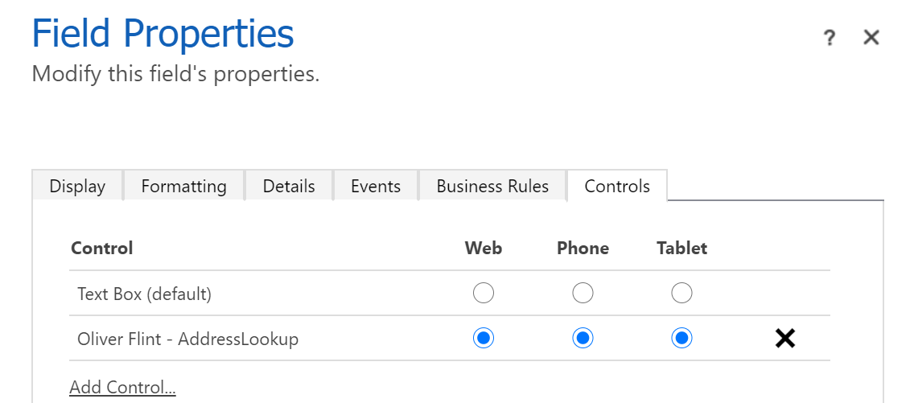
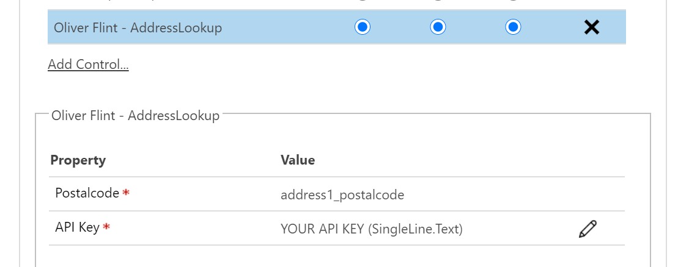
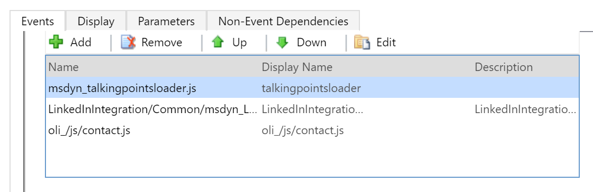
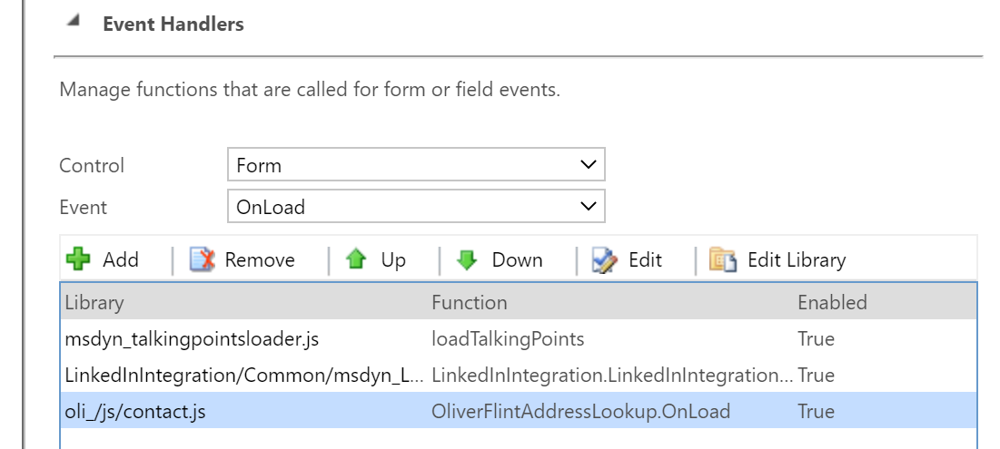
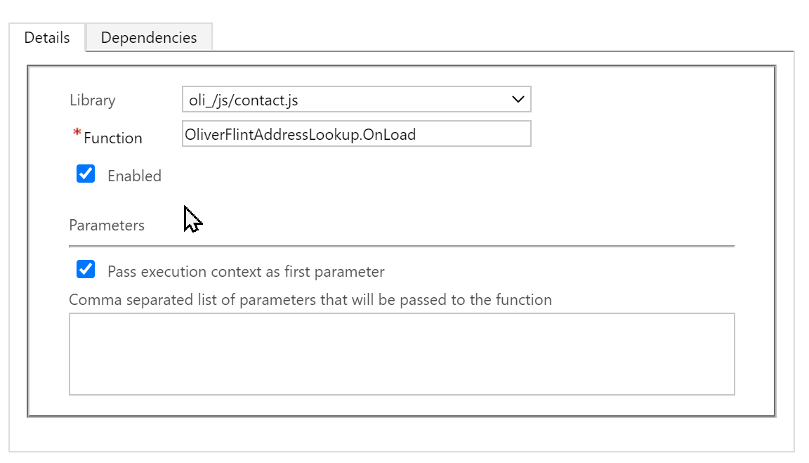

# Setup

## Pre-requisites

To use the control you will need a [getAddress()](https://getaddress.io/) API key. There is a free trial and the paid subscription are very reasonably priced.

## Import Solution

Download and import the latest [release](https://github.com/OliverFlint/PCF-UK-Address-Lookup/releases)

Once the solution has been imported you should have an example form on the contact entity with the address lookup configured enabled.

## Integration with other forms

1) Enable the control on your post code field
    

2) Configure the properties. Enter your [getAddress()](https://getaddress.io/) API key.
    

3) Adding the form script.
   - Add the resource to the form
      
   - Configure the onload event
      
      
   *Note: This form script will work when using the control with the OOTB address fields address1_postalcode, address2_postalcode, and address3_postalcode. If you require integration with custom address fields follow the steps in the next section*

## Integration with custom address fields
If you wish to integrate with custom address fields you will need to add the following to the *On Load* event hander (and replace the correct field names):
```typescript
window.parent.addEventListener("onReceiveAddress", (ev: CustomEvent<EventData>) => {
    if(ev.detail) {
        if(ev.detail.Attribute === "[custom_postcode_field]"){
            const address = ev.detail.Address;
            formContext.getAttribute("[custom_address1_line1_field]").setValue(address.line_1);
            formContext.getAttribute("[custom_address1_line2_field]").setValue(address.line_2);
            formContext.getAttribute("[custom_address1_line3_field]").setValue(address.line_3);
            formContext.getAttribute("[custom_address1_city]_field").setValue(address.town_or_city);
            formContext.getAttribute("[custom_address1_county_field]").setValue(address.county);
            formContext.getAttribute("[custom_address1_country_field]").setValue(address.country);
        }
    }
});
```